# Rocket Simulation 🚀

<div align="center">

<!-- Project status -->


[](https://rocket-simulation-nhoka.vercel.app/)

---

<!-- Repo activity -->


---

<!-- Repo details -->


---

<!-- Tech stack -->


</div>

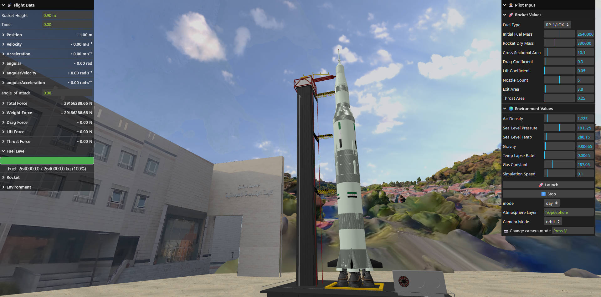

Welcome to **Rocket Simulation**!, a real-time 3D rocket simulation developed to provide an immersive experience of rocket launches. Navigate using rocket model through realistic atmospheric and orbital environments, with physics-based controls that simulate thrust, drag, and gravity. Built with scientific accuracy in mind, this simulation leverages advanced aerodynamics and Newtonian physics to deliver a highly realistic rocket flight experience. 🌌

## Features 🌟

- **Real-time Rocket Simulation**: Launch rockets and control their flight in a fully interactive 3D environment. 🚀

- **Physics-Based Mechanics**: Includes thrust, drag, gravity, and fuel consumption for realistic flight behavior. 🌍

- **Comprehensive Control Panel**: Adjust thrust, gimbal angles, pitch, yaw, roll, and stage separation in real-time. ⚙️

- **Advanced Camera System**:

    * 🎯 Follow Camera: Tracks the rocket automatically.

    * 🔄 Orbit Camera: Rotate freely around the rocket.

    * 🎮 First-Person Camera: Fly with W, A, S, D keys.

- **3D Environment**:

    * 🌍 Earth Model and Launch Platform

    * ☀️🌙 Advanced Day-Night Lighting

    * 🪐 Atmospheric Layers (Troposphere, Stratosphere, Mesosphere/Thermosphere)

    * 🛰 Special Models (ITE Facutly Model, Custom Syrian Rocket Model)

- **Real-Time Data Display**: Shows speed, acceleration, mass, fuel level, thrust, and all acting forces.

- **Sound and Visual Effects**: Realistic rocket exhaust. 🔊

- **Vite Integration**: Fast development and build process. ⚡

## Scientific and Technical Insights 🔬

The simulation uses accurate physics principles and aerodynamics to model rocket flight:

1. **Rocket Mechanics**:

   - **Thrust Control**: Adjust rocket engine power to control ascent speed.
   - **Gravity and Drag**: Simulates realistic acceleration and atmospheric resistance.
   - **Thrust Dynamics**: Acceleration calculated based on mass, fuel, and gravity.

2. **Aerodynamics & Atmospheric Physics**:

   - Realistic air drag and atmospheric resistance.
   - Density changes through atmospheric layers affect flight.
   - Simulates terminal velocity, max Q, and re-entry forces.

3. **Collision Detection**:

   - Rockets cannot pass through terrain or launch pads.
   - Collision forces simulate crashes or impacts realistically.

4. **Environment Rendering**:
   - Earth, skyboxes, and space views with lighting and day-night cycles.
   - Dynamic visual effects during flight and launch.

## Screenshots 📸

<div style="display: flex; flex-wrap: wrap; gap: 5px; justify-content: center;">
    
    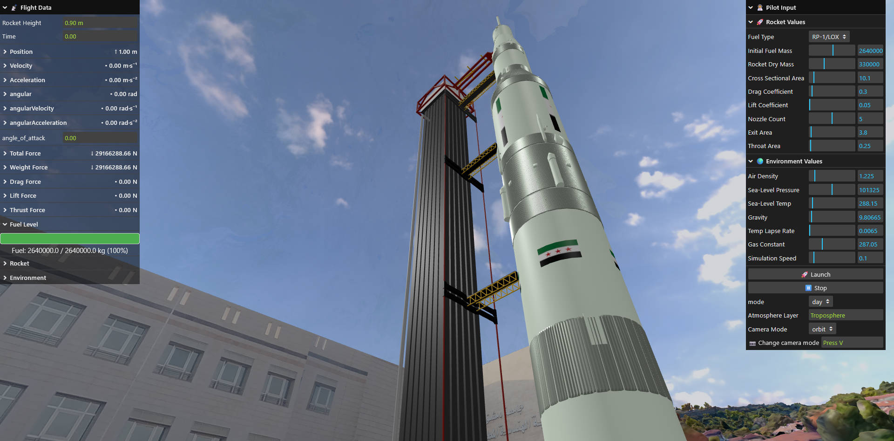
    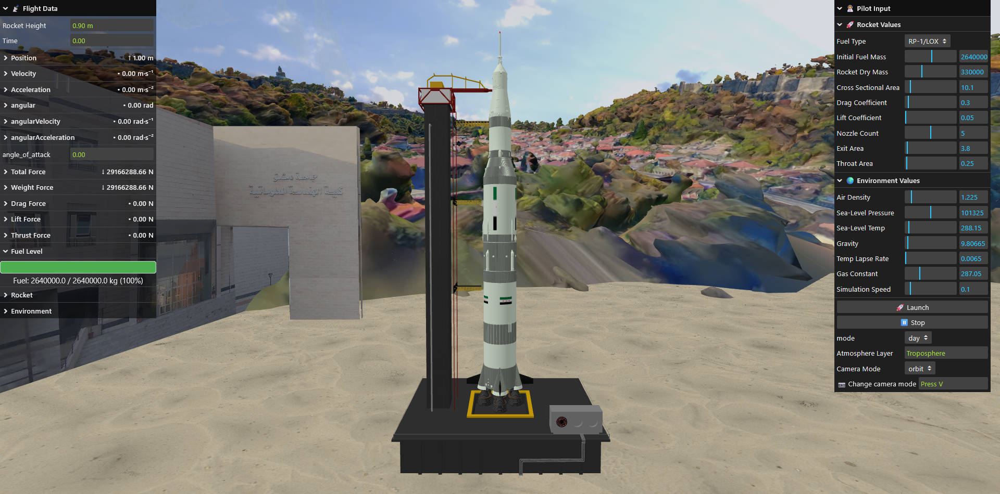
    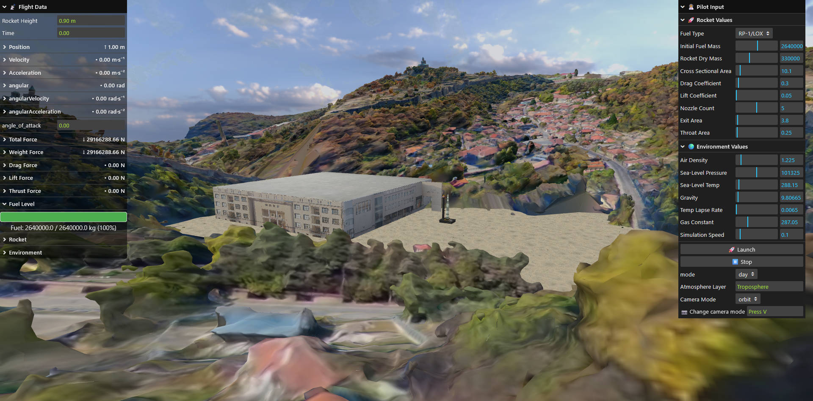
    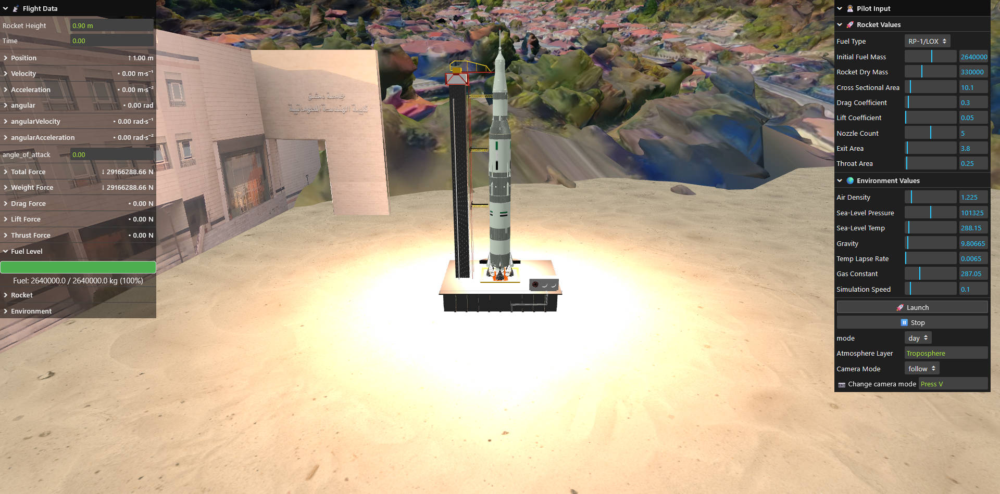
    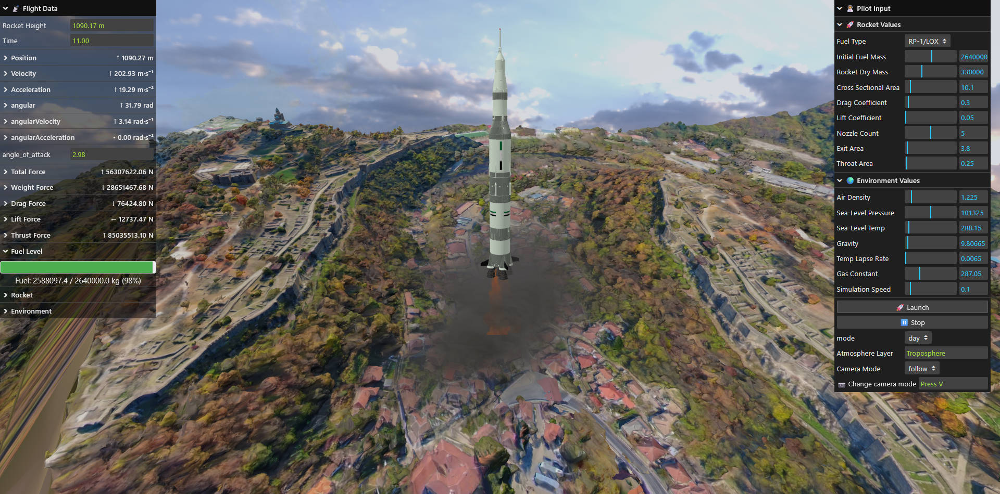
    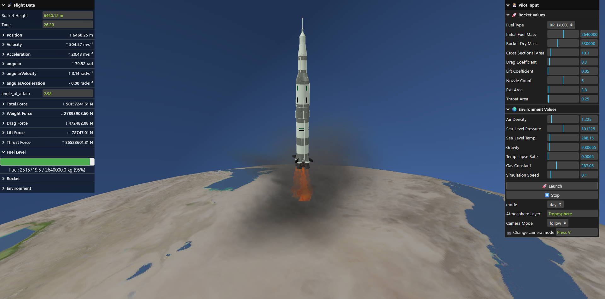
    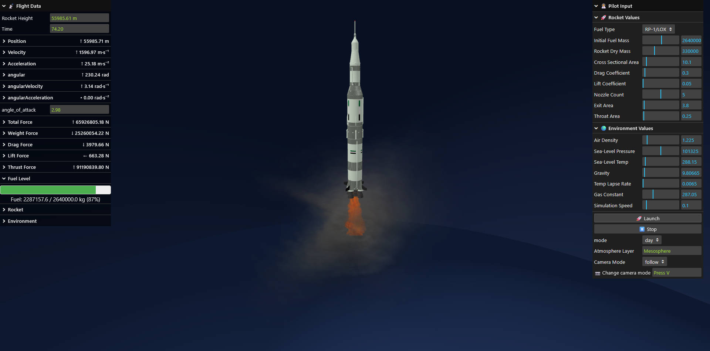
    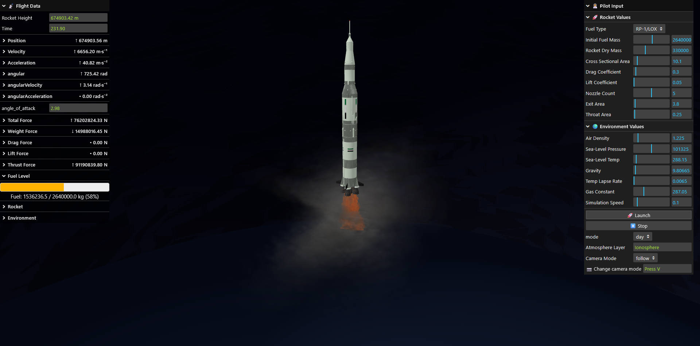
    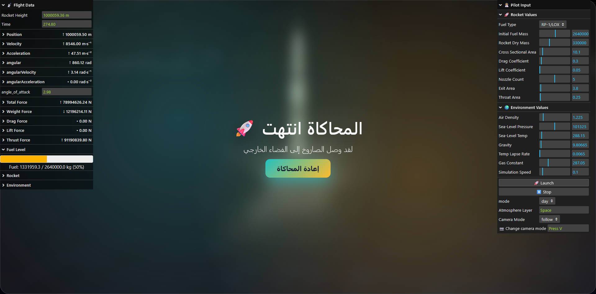
    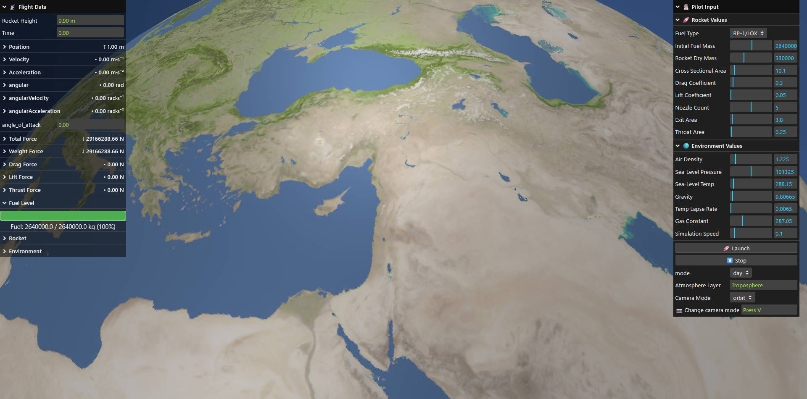
    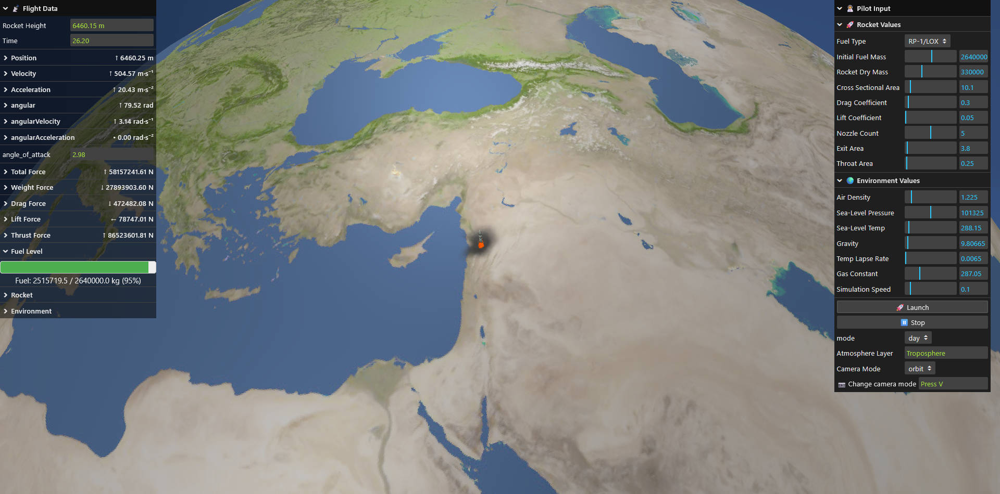
</div>

## Demo Walkthrough 🚀

1. **Model**: Fly using Syrian Saturn V Model.
2. **User Interaction & GUI**:
   - Right GUI: Adjust rocket and environment parameters (fuel, mass, cross-sectional area, drag/lift coefficients, air density, gravity, etc...).
3. **Environment Interaction**:
   - Observe rocket through all atmospheric layers and into space.
4. **Real-Time Data**: View detailed data on rocket physics and environment data in a side panel.

## Technical Specifications ⚙️

- **Frontend**: Developed using **Three.js** for real-time 3D rendering. 🖼️
- **Bundler**: **Vite** provides fast and efficient build processes. ⚡

## Getting Started 🛠️

### Prerequisites

- **Node.js**: Make sure Node.js is installed.

### Installation
You can clone the repository using **two options**:
### Option A: Clone with models (full repository)
1. **Clone the Repository**:
   ```bash
   git clone https://github.com/NGPTechWorld/Rocket_Simulation.git
   ```

2. **Navigate to the Project Directory**:

   ```bash
   cd Rocket_Simulation
   ```

3. **Install Dependencies**:

   ```bash
   npm install
   ```

4. **Run Locally**:

   ```bash
   npm run dev
   ```

   Open the application at [http://localhost:5173/](http://localhost:5173/).

### Option B: Clone without models (download models separately)
1. **Clone the Repository**:
   ```bash
   git clone --branch dev-without-models --single-branch --depth 1 https://github.com/NGPTechWorld/Rocket_Simulation.git
   ```
2. **Navigate to the Project Directory**:

   ```bash
   cd Rocket_Simulation
   ```
3. **Download the models separately from [here](https://t.me/c/2765126981/7)**.
4. **Extract the downloaded folder and it to the same level or src**:
   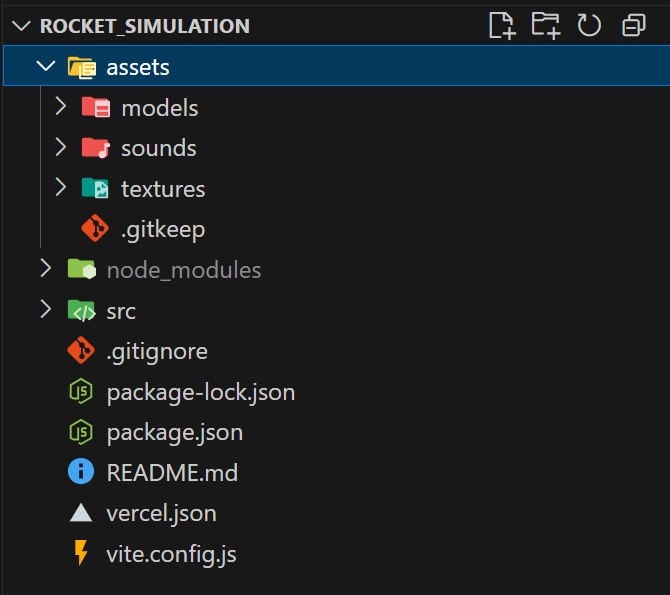
5. **Install Dependencies**:

   ```bash
   npm install
   ```

6. **Run Locally**:

   ```bash
   npm run dev
   ```

   Open the application at [http://localhost:5173/](http://localhost:5173/).
   

### Build for Production

To create an optimized production build:

```bash
npm run build
```

## Live Demo 🌐

The project is also deployed and accessible online at [https://rocket-simulation-nhoka.vercel.app/](https://rocket-simulation-nhoka.vercel.app/).

## Report 📄

The full project report is available [here](https://t.me/c/2765126981/8). It includes detailed information about the physics, and technical design of the rocket simulation.

## Contributing 🤝

We welcome contributions! Here’s how you can contribute:

1. **Fork the repository**.
2. **Create a feature branch** (`git checkout -b feature-name`).
3. **Commit your changes** (`git commit -m 'Add new feature'`).
4. **Push to the branch** (`git push origin feature-name`).
5. **Open a pull request**.

## Contributors 👥
Thanks to all the amazing people who contributed to this project:

[](https://github.com/HasanZaeter)

[](https://github.com/NGPTechWorld)

[](https://github.com/OsamaZerkawi)

[](https://github.com/Kareem-Bizreh)

[](https://github.com/OnlyAbdullh)

## License 📜

This project is licensed under the **MIT License**.
